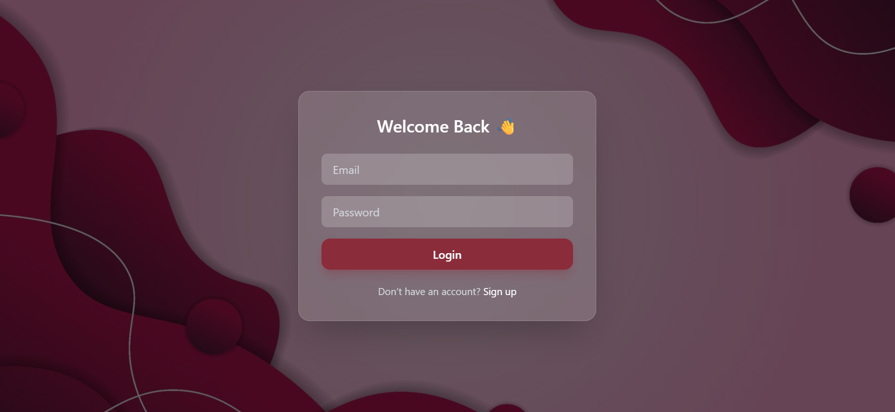
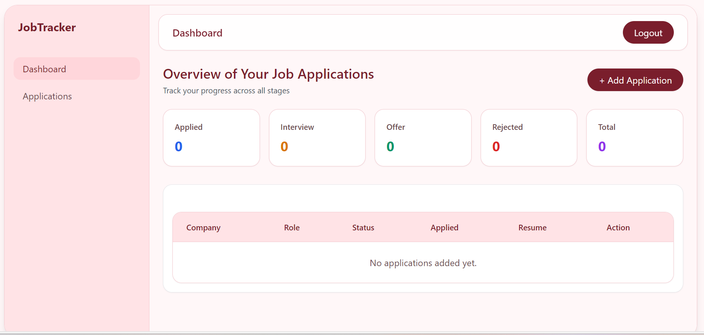
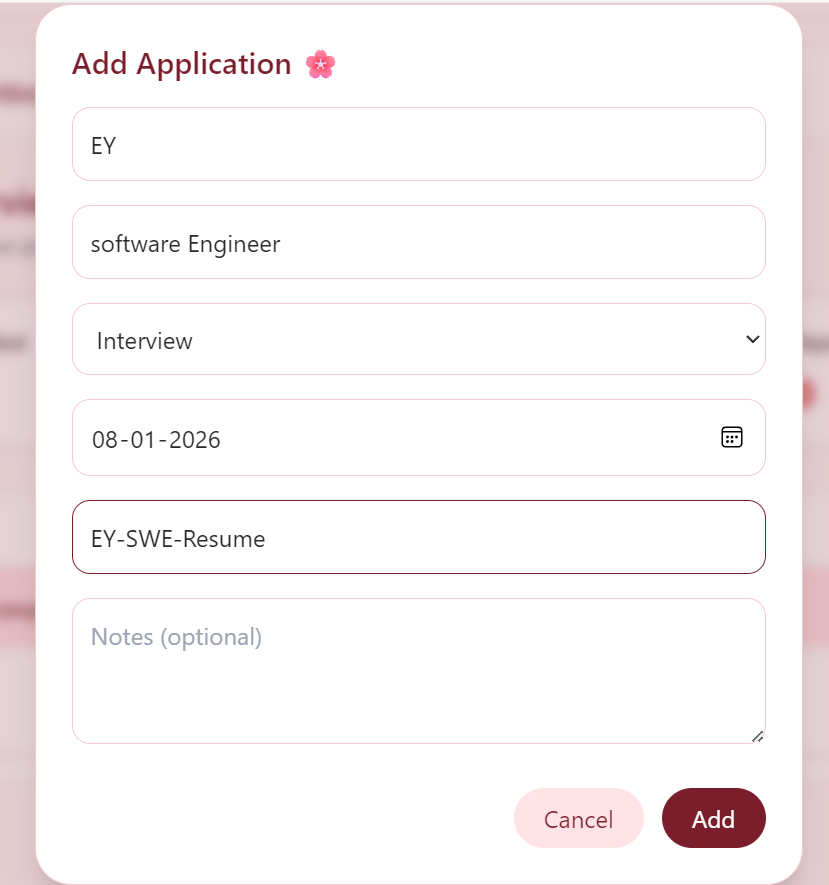
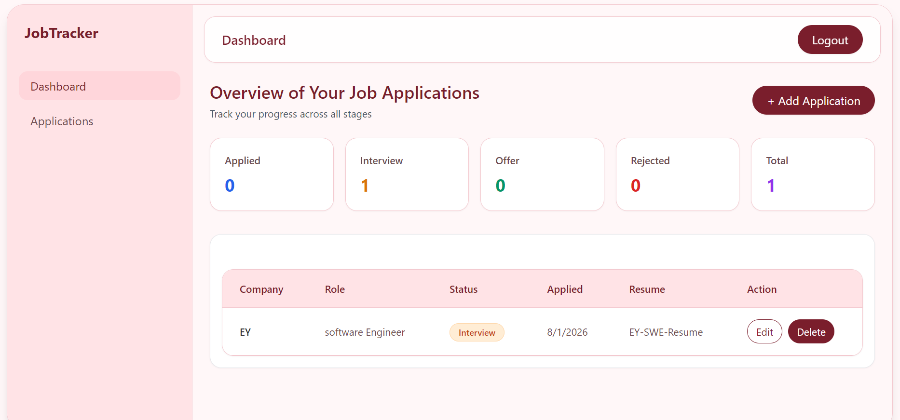

# 🌸 Job Application Tracker

A full-stack Job Application Tracker that helps users manage and monitor their job applications in one place. Users can register, log in, add applications, update status, edit details, and track progress through a clean soft-rose themed dashboard.

Built as a resume-ready project to demonstrate full-stack development skills.

---

## 🚀 Features

* 🔐 User Authentication (Register / Login)
* ➕ Add job applications
* ✏️ Edit existing applications
* 🗑 Delete applications
* 📊 Dashboard with application stats
* 🧾 Applications table with status badges
* 🎨 Soft rose themed responsive UI
* 🔒 Protected routes
* 🌐 REST API integration
* 📱 Mobile responsive layout

---

## 🛠 Tech Stack

### Frontend

* React
* React Router
* Axios
* Tailwind CSS
* Vite

### Backend

* Node.js
* Express.js
* MongoDB
* Mongoose
* JWT Authentication

---

## 📂 Project Structure

```
job-application-tracker/
│
├── frontend/
│   ├── src/
│   ├── components/
│   ├── pages/
│   └── assets/
│
├── backend/
│   ├── routes/
│   ├── models/
│   ├── controllers/
│   └── middleware/
│
├── screenshots/
├── .gitignore
└── README.md
```

---

## ⚙️ Environment Variables (Backend)

Create a `.env` file inside the backend folder:

```
PORT=5000
MONGO_URI=your_mongodb_connection
JWT_SECRET=your_secret_key
```

⚠️ Do NOT upload `.env` to GitHub.

---

## ▶️ Run Locally

### Backend

```bash
cd backend
npm install
npm run dev
```

---

### Frontend

```bash
cd frontend
npm install
npm run dev
```

---

## 📸 Screenshots

screenshots/P1.png
screenshots/P2.png
screenshots/P3.png
screenshots/P4.png
screenshots/P5.png
screenshots/P6.png

```

### Register Page


### Login Page



### Dashboard



### Add Application Modal



### Updated Dashboard



### Application


---

## 💡 Resume Value

This project demonstrates:

* Full-stack CRUD operations
* Authentication & protected routes
* REST API design
* Database modeling
* State management
* Responsive UI design
* Component-based architecture
* Production-style project structure

---

## 🔮 Possible Improvements

* Toast notifications
* Resume upload
* Status filters & search
* Charts for analytics
* Email reminders
* Export to CSV/PDF

---


## 📄 License

Free to use for learning and portfolio purposes.
